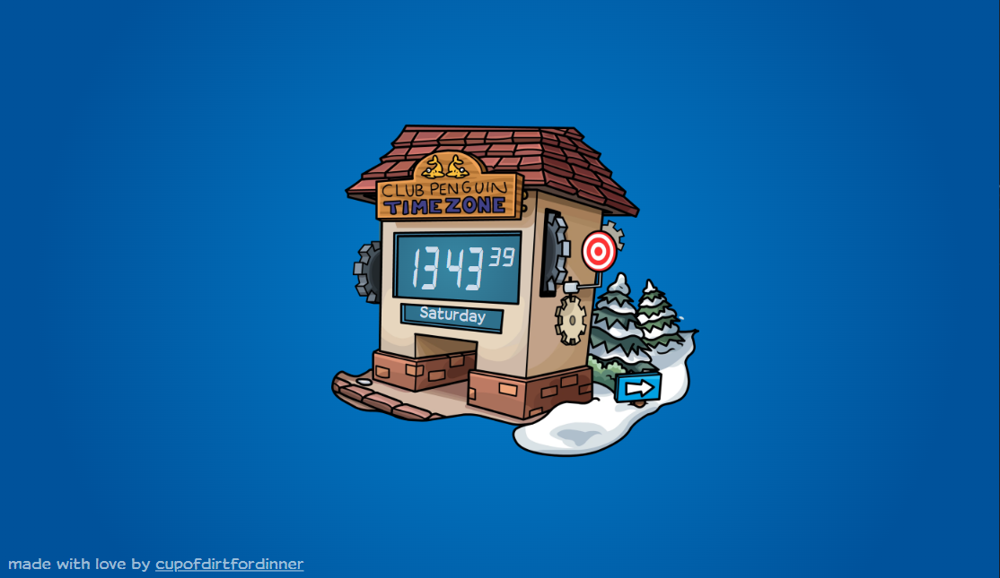
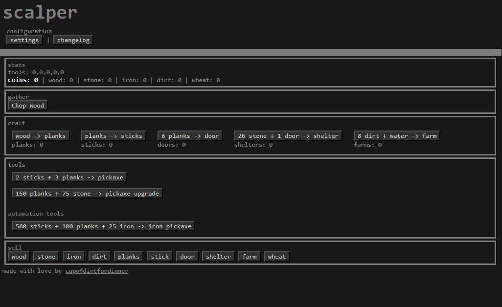
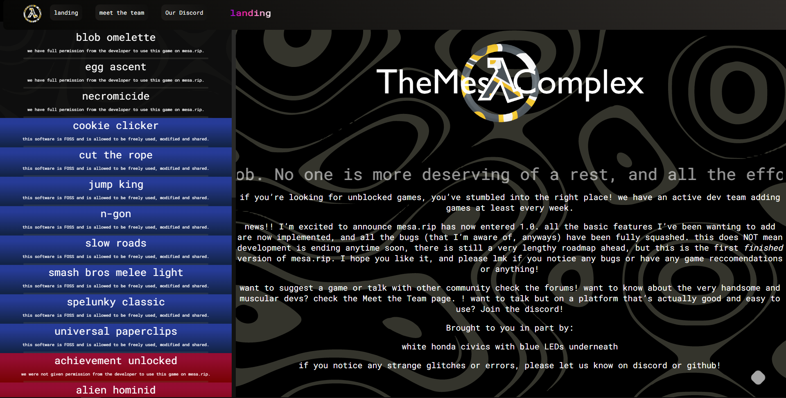
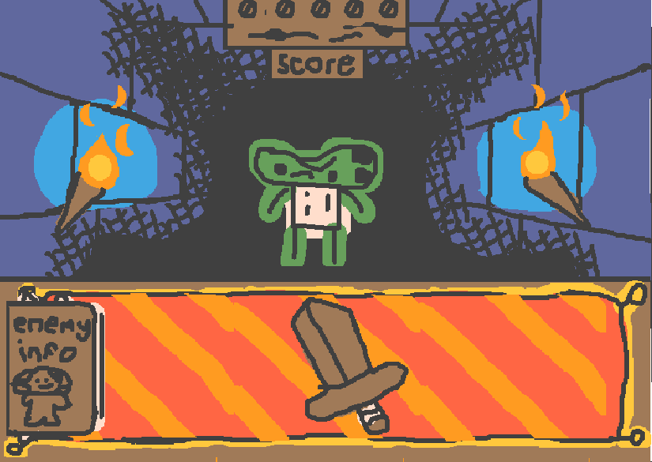
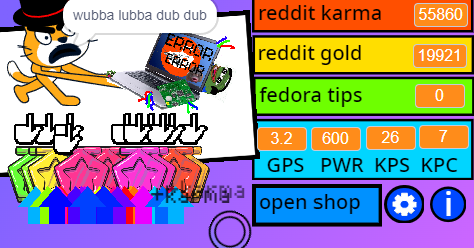
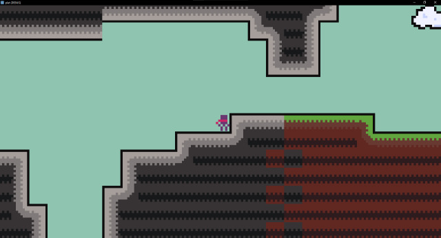



        <h2>about me</h2>
        
Hi, im dirt! I'm a 15 year old 3D/pixel(?) artist and (primarily web) developer from texas.

    

<h2>art</h2>















 

 

 

  

    

        <a href="https://cupofdirtfordinner.github.io/penis-world">
            <video width="320" height="240" controls>
                <source src="art\test renderrrr.mp4" type="video/mp4">
                if you dont see this, sucks to suck. protip: try swallowing
                </video>
            
eyes emoji? this is a test render for an animation im working on

            
circa: january 2023 - present 

        </a>
    

<h2>websites</h2>

    

    

        <a href="https://cupofdirtfordinner.github.io/penis-world">
            
            
this is penis world, a shitpost webcomic that never got finished.

            
circa: august 2023 

        </a>
    

    

        <a href="https://cupofdirtfordinner.github.io/penguintime">
            
            
this is a clock that looks like the Penguin Standard Time clock from club penguin, with some small changes. Namely it's 24 hours instead of 12, and it counts seconds.

            
circa: april 2023 - present (working on making the site look better on mobile)

        </a>
    

    

        <a href="https://cupofdirtfordinner.github.io/scalper">
            
            
this is an idle game inspired by Universal Paperclips and Grindcraft. I still want to finish it at some point.

            
circa: march 2023 (maybe a little before then)

        </a>
    

    

        <a href="https://mesa.rip/">
            
            
Mesa.rip is an unblocked game website I made by myself. It was a successor to <a href="https://mesacomplex.tk/" style="text-decoration:underline;color:blue">the mesa complex</a>,  though Development has mostly stopped because putting ads on it seemed infeasable.

            
circa: q1 - q4 2022

        </a>
    

<h2>etc.</h2>

    

        <a href="https://sok-stories.com/?ENKQ">
            
            
Dungeoncross was a game I made in sok stories, a very simple fantasy console where the only code you can write is like object + object (spawns) object. I managed to make a full ass roguelite in it, which is pretty cool  I think.

            
circa: december 2021

        </a>
    

    

        <a href="https://scratch.mit.edu/projects/416984061/">
            
            
This was an old idle game I made in scratch. I dumped like hours into making it, and I like to think it's relatively polished.

            
circa: september - august 2020

        </a>
    

    

        <a href="">
            
            
I watched a miziziziz tutorial on making a platformer and thought I could make a full collectathon metroidvania. I was wrong, but I might revisit the idea one day because there's some potential, but I'd have to restart because the project files have been lost to time (that's code for a broken laptop)

            
circa: febuary 2022

        </a>
    

    

        <a href="">
            
            
I wanted to start actually learning godot, so I started to make a 3D platformer and looked up a tutorial. Beyond adding a simple double jump, I did not actually learn godot. I made the placeholder assets of the skybox and the little t posing man, godspeed

        </a>
    

    

        <a href="">
            <video width="320" height="240" controls>
                <source src="gaydev.mp4" type="video/mp4">
                if you dont see this, sucks to suck. protip: kill yourself
                </video>
            
After giving up on the 3d platformer for being too hard to code, I'm not sure why I chose to make something harder instead. either way, im still working on this and learning bit by bit; the project looks a little different now but i dont feel like recording a new video bc you get the dealio, it's an indev vr game

        </a>
    

